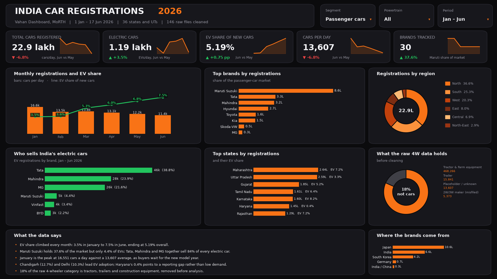
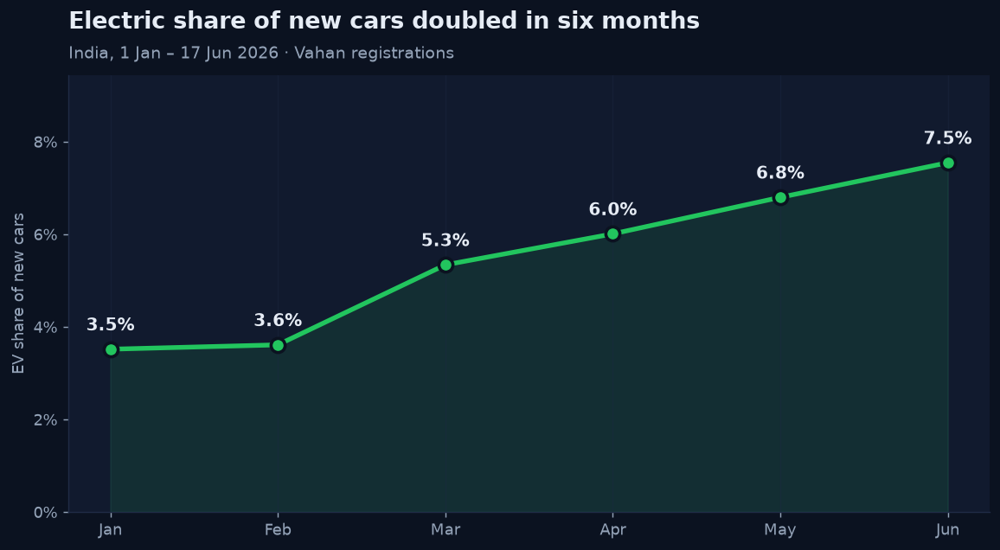
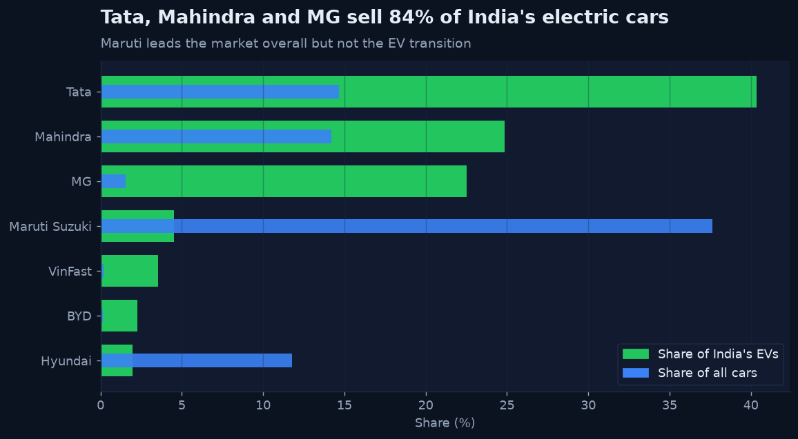
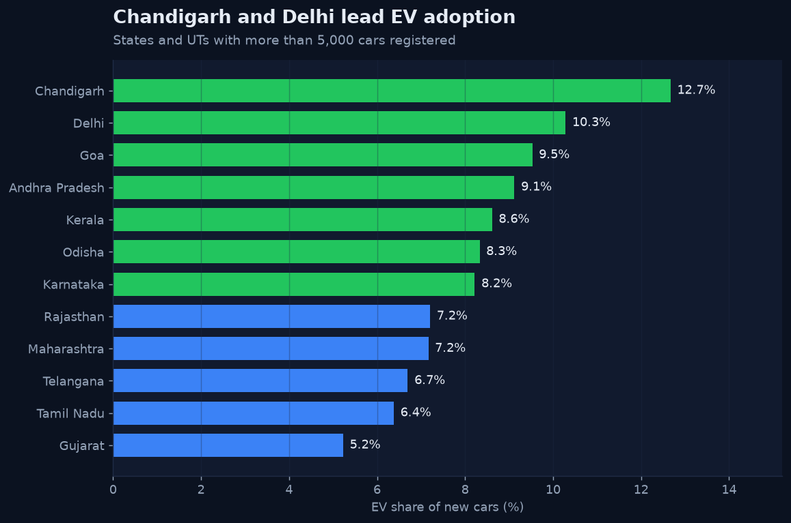
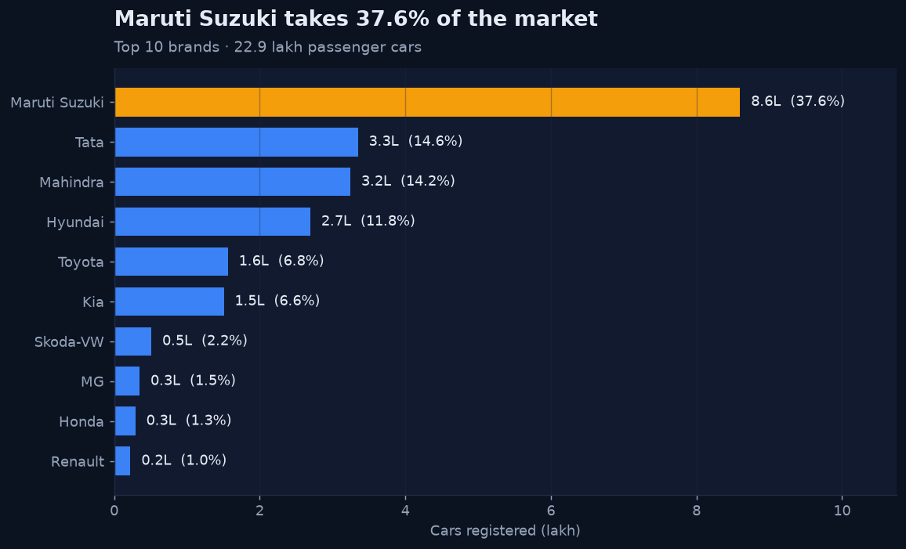
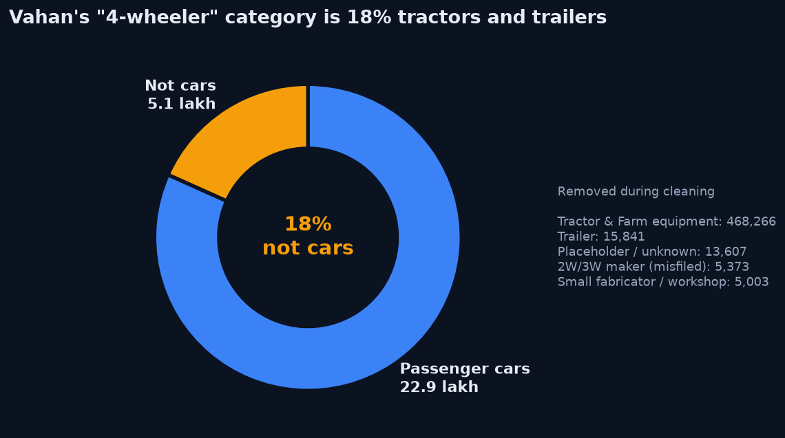

# India's Car Market in 2026 — Vahan Registration Analysis

End-to-end analysis of **every new four-wheeler registered in India between 1 Jan and 17 Jun 2026**: 146 raw government files, cleaned with Python, modelled into a star schema, and visualised in Tableau.

**Source:** [Vahan 4 Dashboard](https://vahan.parivahan.gov.in/vahan4dashboard/), Ministry of Road Transport & Highways, Government of India (via the daily mirror [hrshlpnchl/Vahan_data](https://github.com/hrshlpnchl/Vahan_data)).

**[Open the interactive dashboard](https://claude.ai/artifact/A5J6KZdibKaMYC4x3LYys8)** · [Cleaning log](reports/cleaning_log.md) · [Tableau workbook](tableau/India_Car_Registrations_2026.twbx)



---

## Headline findings

| | |
|---|---|
| Passenger cars registered | **22.9 lakh** (≈13,600 per day) |
| EV share | **5.2%** overall — **3.5% in January → 7.5% in June** |
| EV leaders | Tata 38.8%, Mahindra 23.9%, JSW MG 21.6% of all EVs |
| Highest EV adoption | Chandigarh 12.7%, Delhi 10.3%, Goa 9.5% |
| Market leader | Maruti Suzuki, 37.6% of all cars — but only 4.4% of EVs |
| Hidden in the raw data | ~18% of the "4-wheeler" category is tractors and trailers |

### EV share rose every single month



### The market leader is not leading the transition



### Adoption is geographic



### Four brands, three-quarters of the market



### Why cleaning mattered

Vahan's "4W" category is not a list of cars. Without separating it out, every market-share number in this project would have been wrong.



---

## What made this data messy

| Problem in the raw files | How it was handled |
|---|---|
| 146 .xlsx exports (36 states/UTs + all-India × all-fuel/EV-only × 2 snapshots) | Parsed and stacked into one long table |
| Two different export layouts (single header vs. multi-row "Month Wise" header) | Layout-agnostic reader that locates the `Maker` row and month labels |
| Title rows, serial-number column, `TOTAL` column | Kept rows with a serial number; used `Total` to validate row sums |
| Trade-certificate codes glued to maker names (`...WORKS AP118063632`), `M/S` prefixes, `MERCEDES -BENZ` | Regex normalisation: 614 → 607 names |
| Tractors, trailers, JCBs and two-wheeler makers filed under "4W" | Rule-based segment classifier; only passenger cars analysed |
| Several legal entities per brand (Tata Motors PV + Tata Passenger Electric) | Mapped to brand, parent group and country of origin |
| Newer snapshot back-fills earlier months (8,603 late registrations) | Kept the latest snapshot only |
| EV counts held in separate files | Non-EV = all-fuel − pure-EV, checked for negatives |
| June holds only 17 days of data | `days_covered` column and per-day measures |
| State EV files total 2,990 fewer EVs than the national file | Documented rather than silently patched |

**Validation:** the 36 state files sum to exactly the all-India total (2,797,504 four-wheelers), and every row's monthly values reconcile against its own `Total` column.

Full step-by-step log: [`reports/cleaning_log.md`](reports/cleaning_log.md)

---

## Interactive dashboard

[Open it here.](https://claude.ai/artifact/A5J6KZdibKaMYC4x3LYys8) Filter by region, powertrain and month, or click any brand or state to cross-filter every panel; the KPIs, charts and written insights all recalculate from the selection.

Built as a single self-contained page: [`web/build_data.py`](web/build_data.py) packs the cleaned data into a 72 KB JSON bundle and [`web/build_page.py`](web/build_page.py) injects it into [`web/page_template.html`](web/page_template.html). Charts use ECharts; the categorical palette is validated for deutan, protan and tritan colour vision.

```bash
python3 web/build_data.py && python3 web/build_page.py   # -> web/dashboard.html
```

## Tableau workbook

10 worksheets and 2 dashboards ("Overview", "The EV Shift") over 5,686 rows of cleaned data.

Tableau Public requires an extract before a workbook can be published. On opening
`India_Car_Registrations_2026.twbx` it shows that reminder: click OK, then
**Data Source tab > Create Extract**. Tableau Desktop opens it without the prompt.

The workbook is generated programmatically rather than clicked together — [`tableau/make_workbook.py`](tableau/make_workbook.py) writes the `.twb` XML and [`tableau/make_extract.py`](tableau/make_extract.py) builds the extract, so the whole dashboard rebuilds from the raw data with one command.

```bash
python3 tableau/make_extract.py && python3 tableau/make_workbook.py
```

---

## Project structure

```
data/raw/vahan_4w/        146 untouched government exports
clean.py                  cleaning pipeline (pandas)
data/clean/               star schema + flat file + Excel workbook
  fact_registrations      month × state × maker × powertrain
  dim_maker               brand, parent group, origin country, segment
  dim_state               region, ISO code, map location
  dim_date                month, quarter, days covered
figures/                  dashboard + chart scripts and rendered PNGs
web/                      interactive dashboard: data packer, template, built page
tableau/                  workbook generator, extract builder, .twbx, build guide
powerbi/                  DAX measures, custom theme, build guide
reports/cleaning_log.md   what was cleaned, and how much
```

## Reproduce

```bash
pip install pandas openpyxl matplotlib tableauhyperapi
python3 clean.py
python3 figures/make_figures.py
python3 tableau/make_extract.py && python3 tableau/make_workbook.py
```

## Tools

Python (pandas, matplotlib, Hyper API) · Tableau · Power BI (DAX, star-schema modelling) · Excel

## Caveats

- Data ends 17 Jun 2026 (the source's last snapshot); June is a partial month, so comparisons use per-day figures.
- Vahan counts **registrations**, not factory dispatches — SIAM's figures will differ.
- Haryana's 0.4% EV share is likely under-reporting rather than reality, given the 2,990-EV gap between state and national files.
